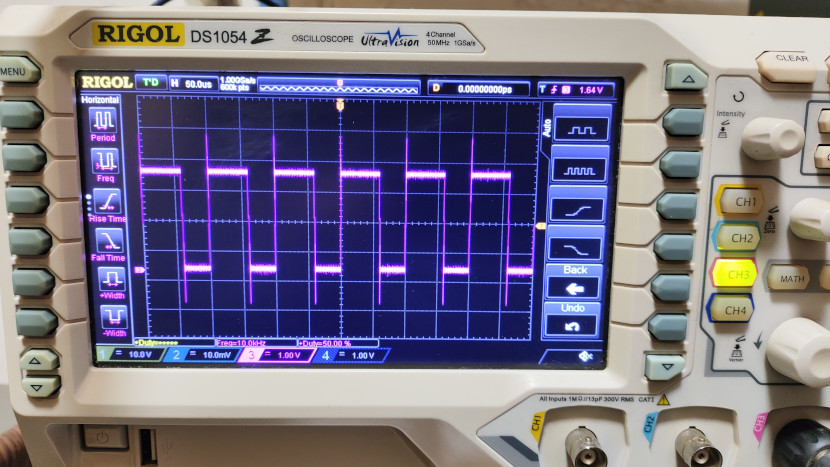

# ESP32 RMT-based Adjustable PWM Example

A demonstration project showcasing PWM signal generation with adjustable duty cycle using ESP32's RMT (Remote Control) peripheral through ESP-IDF framework.



If this open source project has been useful to you, please consider giving it a star. If it truly saved your life, you can buy me a coffee. Thank you!


<a href='https://ko-fi.com/O5O2U4W4E' target='_blank'></a> &nbsp; &nbsp; &nbsp; &nbsp; [](https://www.paypal.me/oldrev)


## Project Description

This project implements a PWM generation solution using ESP32's RMT (Remote Control) peripheral, specifically designed to supplement the built-in LEDC PWM modules when all hardware PWM channels are occupied. By creatively repurposing the typically IR-focused RMT peripheral, developers can obtain additional PWM outputs while maintaining flexible duty cycle control.

## Key Features

- ✅ Provides extra PWM channels when LEDC resources are exhausted
- ✅ Dynamic duty cycle adjustment at runtime
- ✅ Configurable PWM frequency (10kHz default)
- ✅ Parallel operation with existing LEDC PWM modules
- ✅ Resolution up to 100 steps

## Hardware Requirements

- ESP32 series development board (Tested with ESP32-C3-DevKitM-1 V1.0)
- Oscilloscope for signal verification

## Hardware Connection

**Default Configuration:**
- Signal GPIO:  **`GPIO19`**
- RMT Channel:  **`RMT_CHANNEL_0`**

## Getting Started

### Prerequisites
- ESP-IDF v5.x+ installed
- ESP32 toolchain setup
- Serial terminal application (e.g., `screen`, `minicom`)

### Installation & Usage

#### Clone repository:

```bash
git clone https://github.com/oldrev/esp32c3-rmt-pwm-demo.git
cd esp32c3-rmt-pwm-demo.git
```

#### Build and flash:

```
bash
idf.py build
```

```
bash
idf.py flash monitor
```

Observe PWM wave pattern (cycle time: 10 seconds)

## License

Distributed under the Apache 2.0 License. See [LICENSE](LICENSE) for more information.

## Contributing

Contributions are welcome! Please open an issue or submit a PR for any improvements.